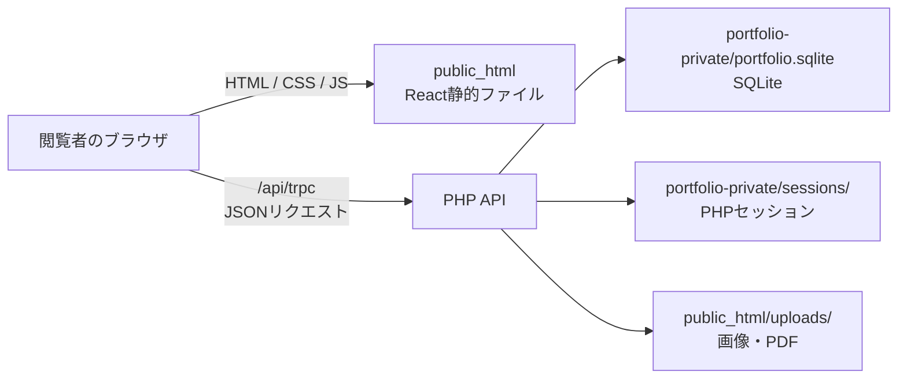

# 月春の資材置き場


作品、写真、読書記録、Blog、自己紹介を管理・公開する個人ポートフォリオです。公開サイトはReactの静的ファイルとPHP APIで動作し、データとアップロード画像は契約中のXServer内に保存します。外部CMS、クラウドDB、常時起動するNode.jsサーバーは使いません。

## 公開環境の構成



| 役割 | 技術・保存先 |
| --- | --- |
| 画面 | React、TypeScript、Viteで生成した静的ファイル。`dist/public` の内容を `public_html` に配置します。 |
| データ通信 | ブラウザから同一ドメインの `/api/trpc` へHTTPSでJSONを送信します。PHPが既存画面と互換のtRPC/SuperJSON形式で応答します。 |
| API・認証 | PHP 8.1以上。`api/index.php` がリクエストを受け、管理画面のログインはPHPのサーバーサイドセッションで管理します。 |
| データベース | SQLite。プロフィール、作品、本、写真、Blog、訪問者、コメント、いいね、レート制限用の記録を保存します。 |
| メディア | 画像・PDFは `public_html/uploads`。画像はPHP GDで検証・再エンコードし、PDFはダウンロードとして配信します。 |

## サーバー上のファイル配置

データベースと設定は、外部公開される `public_html` の外側に置きます。

```text
<XServerの契約領域>/
  portfolio-private/                 # HTTPで直接公開しない
    config.php                        # サイトURLと管理者パスワードハッシュ
    portfolio.sqlite                  # SQLiteデータベース
    sessions/                         # PHPのログインセッション
  public_html/                        # ドメインの公開ディレクトリ
    index.html
    assets/                           # Viteが出力するJS/CSS/SVG
    api/                              # PHP API
    uploads/                          # 管理画面から追加した画像・PDF
    .htaccess                         # SPA/APIのルーティング
```

`PORTFOLIO_PRIVATE_DIR` を設定すると、`portfolio-private` の場所を変更できます。設定しない場合は、PHP公開ディレクトリと同じ階層にある `portfolio-private` を使います。

## データの流れ

公開ページを開くと、Reactが `/api/trpc` から作品・写真・本・Blog・プロフィールを取得し、PHPがSQLiteから読み出してJSONで返します。管理者が `/admin` で保存すると、ブラウザは同じAPIへPOSTし、PHPがログイン状態・送信元・入力値を確認したうえでSQLiteへ書き込みます。

画像やPDFを追加すると、管理画面からAPIへ送信されます。PHPはMIMEタイプと容量を確認し、画像は最大辺1600pxに収めて再保存します。生成された `/uploads/...` のURLだけがコンテンツレコードに保存されます。ファイルを共有している場合があるため、コンテンツを削除してもアップロードファイルは自動削除されません。

公開用の読み取りと管理用の書き込みは同じドメイン内で完結します。外部サービスにコンテンツ、パスワード、FTP情報を送信する処理はありません。

## セキュリティと運用

- 管理画面は `/admin`。パスワードは平文では保存せず、PHPのパスワードハッシュを設定します。
- ログイン後のセッションCookieは `HttpOnly`、`SameSite=Lax`、HTTPS環境では `Secure` を付けます。
- 更新系APIはPOST、同一オリジン確認、専用リクエストヘッダーを要求します。ログイン・コメント・いいねにはSQLiteに記録するレート制限があります。
- SQLite、設定ファイル、セッションは必ず `public_html` 外に置いてください。`uploads` と `portfolio-private` はリリース時に上書き・削除しません。
- バックアップは `portfolio-private/portfolio.sqlite`、`public_html/uploads`、`config.php` を対象に取ります。書き込み中のSQLiteを単純コピーする代わりに、`php xserver/manage.php export` で内容JSONを作成できます。

## XServerへ公開する手順

必要な環境はPHP 8.1以上、PDO SQLite、GD、DOM/libxml、fileinfo、セッション、Apacheの`.htaccess`書き換え、HTTPSです。

1. ローカルで `pnpm install --frozen-lockfile`、`pnpm build` を実行します。
2. `dist/public` **の中身**をサーバーの `public_html` へアップロードします。隠しファイルの `.htaccess` も含めます。
3. `public_html` の外に `portfolio-private` を作り、書き込み可能にします。
4. `php xserver/manage.php password-hash` で管理者パスワードのハッシュを作り、`portfolio-private/config.php` を作成します。
5. `/admin` でログインし、保存・画像アップロード・PDFダウンロード・各公開ページを確認します。

`config.php` の内容は次の形です。実際のパスワードやハッシュはGitHubへ追加しません。

```php
<?php
return [
  'origin' => 'https://あなたのドメイン',
  'password_hash' => '生成したパスワードハッシュ',
];
```

UIだけを更新する場合も `pnpm build` を実行して `dist/public` のアプリファイルを更新します。このとき、サーバー上の `uploads` と `portfolio-private` は保持してください。

## ローカル開発と検証

Node.jsとpnpmはローカルのビルド・テスト用途だけです。公開サーバーでNode.jsを起動する必要はありません。

```sh
pnpm install --frozen-lockfile
php xserver/manage.php init http://127.0.0.1:5173
pnpm dev:api
# 別のターミナルで
pnpm dev
```

```sh
pnpm check
pnpm test
pnpm build
node scripts/test-xserver.mjs
```

ブラウザを使うレスポンシブ検証は、PHPのローカルプレビュー起動後に `pnpm test:responsive` を実行します。320、375、430、768、1024、1440pxで、公開ページ・管理画面・メニュー・キーボード・タッチ操作・`prefers-reduced-motion` を確認します。

直近のローカル検証では、TypeScript、26ファイル91件のVitest、PHP/API統合、既存ブラウザフロー、186件のレスポンシブ検証、配布用ビルドが通過しています。実機スマホ、Safari/Firefox、スクリーンリーダー、本番XServer環境は別途確認が必要です。

## 主要な場所

- `client/` — React画面とスタイル
- `xserver/public/api/` — PHP API、認証、SQLiteアクセス、アップロード処理
- `xserver/manage.php` — 初期化、パスワードハッシュ、データのexport/import
- `xserver/public/.htaccess` — SPAとAPIのURL振り分け
- `docs/XSERVER.md` — XServer向けの詳細な導入・バックアップ手順
- `docs/UI-UX-AUDIT.md` — UI/UX・レスポンシブの改善記録
