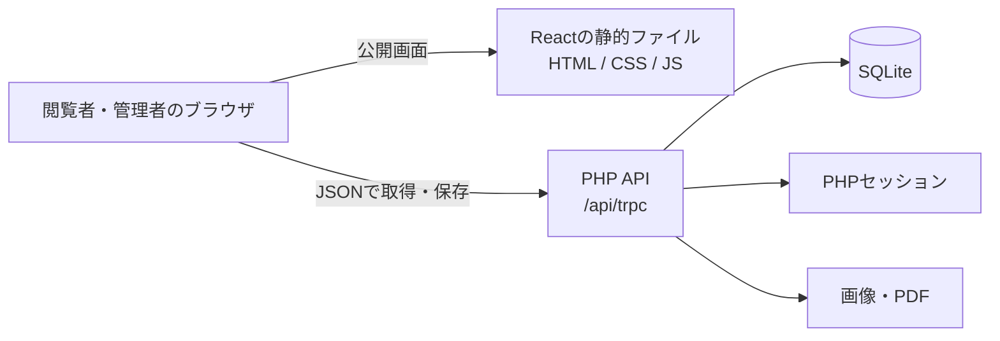

# 月春の資材置き場


作品、写真、読書、日々の記録をまとめる個人ポートフォリオです。見た目だけでなく、コンテンツを自分で編集して長く運用できることを目指して、レンタルサーバー上で完結する小さな公開・管理システムとして実装しています。

## どんなサイトか

公開側にはWorks、Gallery、Library、Blog、Aboutを用意し、管理画面からプロフィール、作品、写真、本、記事、画像、PDFを更新できます。公開画面は余白と文字組を中心にした静かなアーカイブとして設計し、モバイルでは専用のハンバーガーメニューへ切り替わります。

Homeの「制作と日々の記録」は、各カテゴリの最新記録を優先した1行のプレビューです。画面幅に応じて1〜4件を表示し、投稿数の多いカテゴリだけが並ばないように選びます。記録の一覧はそれぞれのカテゴリページで閲覧できます。

バックエンドには、個人サイトの更新頻度と規模に合うPHPとSQLiteを採用しています。外部CMSやクラウドDBを増やさず、サイトのデータ、ログイン状態、アップロードメディアをXServer内で管理する構成です。

## 技術構成

| 領域 | 採用技術 | 役割 |
| --- | --- | --- |
| フロントエンド | React / TypeScript / Vite / Wouter | 画面、ルーティング、編集UI、静的アセットの生成 |
| UI | Radix UI / CSS | ダイアログ、シート、キーボード操作、レスポンシブレイアウト |
| API | PHP 8.1+ | コンテンツ操作、認証、バリデーション、アップロード処理 |
| 通信形式 | tRPC互換のJSON / SuperJSON | 既存のReact Queryフックを保ったままPHP APIと接続 |
| 永続化 | SQLite | コンテンツ、訪問者、コメント、いいね、レート制限情報 |
| 画像処理 | PHP GD / fileinfo | 画像の検証・縮小・再エンコード、PDFの検証 |
| ホスティング | XServer / Apache / HTTPS | 静的ファイル、PHP API、アップロードメディアの配信 |

Node.jsはローカルでのフロントエンドビルドとテストにだけ使います。公開環境でNode.jsのプロセスを常駐させる必要はありません。

## アーキテクチャ



Reactのクライアントは同一ドメインの `/api/trpc` にJSONリクエストを送ります。PHPは受け取った手続きを振り分け、SQLiteを読み書きして、SuperJSONのメタデータを含むレスポンスを返します。フロントエンド側の型付きクエリとキャッシュの扱いを維持しつつ、レンタルサーバーで動くPHP実装に置き換えるためのアダプターとして設計しています。

管理画面の更新も同じ経路です。ログイン済みのブラウザからPOSTされたデータをPHPが検証し、SQLiteへ保存します。公開ページでは公開状態のレコードだけを返します。

## データとファイルの置き場所

公開ディレクトリと、公開してはいけない情報を分けています。

```text
<XServerの契約領域>/
  portfolio-private/                 # HTTPから到達しない領域
    config.php                        # 許可オリジン、管理者パスワードハッシュ
    portfolio.sqlite                  # コンテンツと運用データ
    sessions/                         # PHPログインセッション
  public_html/                        # 公開ディレクトリ
    index.html
    assets/                           # Viteが出力するハッシュ付きアセット
    api/                              # PHP API
    uploads/                          # 管理画面から追加した画像・PDF
    .htaccess                         # SPA/APIのルーティング
```

SQLiteにはプロフィール、Works、Books、Gallery、Blog記事、訪問者名、コメント、いいね、レート制限のカウンターを保存します。画像・PDFはデータベースへ直接格納せず、`uploads` にランダムな名前で保存し、コンテンツ側にはそのURLを持たせます。これにより、DBのバックアップとメディアのバックアップを独立して扱えます。

`PORTFOLIO_PRIVATE_DIR` を設定すれば、プライベート領域の位置を環境に合わせて変えられます。

## メディア処理と安全性

画像アップロード時は、ブラウザ側の最適化に加えてPHP側でもMIMEタイプと解像度を確認します。GDで最大辺1600pxに縮小・再エンコードし、対応環境ではより小さくなる場合にWebPを使います。PDFはサイズ、MIMEタイプ、ファイルシグネチャを確認してから保存し、ブラウザでの直接実行ではなくダウンロードとして配信します。

管理者認証にはPHPのパスワードハッシュとサーバーサイドセッションを使います。更新系のAPIはPOST、同一オリジン確認、専用ヘッダーを要求し、ログイン、コメント、いいねにはSQLiteに記録するレート制限があります。セッションCookieには `HttpOnly` と `SameSite=Lax` を付与し、HTTPSでは `Secure` も有効になります。

## 運用の考え方

リリース対象は `dist/public` の中身です。アプリの更新時に置き換えるのは、静的ファイル、PHP API、ハッシュ付きアセットです。一方、`portfolio-private` と `uploads` はコンテンツと運用状態を持つため維持します。

バックアップでは、SQLite、`uploads`、プライベート設定を一組として扱います。コンテンツだけを移す場合には、`xserver/manage.php` がJSON形式のexport/importを提供します。SQLiteを使うことで、個人ポートフォリオに必要な単一サーバー上のシンプルさと、データの持ち運びやすさを両立しています。

## リポジトリ案内

| 場所 | 内容 |
| --- | --- |
| `client/` | React画面、コンポーネント、スタイル、SVGロゴ |
| `client/src/pages/` | Home、Works、Gallery、Library、Blog、About、Adminのページ |
| `xserver/public/api/` | PHP API、認証、SQLiteアクセス、入力検証、メディア処理 |
| `xserver/public/.htaccess` | ApacheでのSPAとAPIのURL振り分け |
| `xserver/manage.php` | 初期化、パスワードハッシュ、コンテンツのexport/import |
| `scripts/` | 配布物の生成と、PHP・ブラウザ検証 |

## 開発・検証

ローカルではViteとPHPの開発サーバーを並行して起動します。

```sh
pnpm install --frozen-lockfile
php xserver/manage.php init http://127.0.0.1:5173
pnpm dev:api
# 別のターミナルで
pnpm dev
```

```sh
pnpm check
pnpm test
pnpm build
node scripts/test-xserver.mjs
```

レスポンシブ検証は320、375、430、768、1024、1440pxで、公開ページ、管理画面、メニュー、キーボード、タッチ操作、`prefers-reduced-motion` を確認します。Homeのカテゴリ選択は単体テストでも確認しています。

2026年10月10日の変更ではTypeScript、26ファイル94件のVitest、配布用ビルドが通過しました。Homeの1行表示は検証用APIレスポンスを使い、境界幅を含む11画面幅で確認しています。PHP/API統合、既存ブラウザフロー、186件のレスポンシブ検証の直近の実施日は10月9日です。

詳しいXServerへの導入・バックアップ手順は [docs/XSERVER.md](docs/XSERVER.md)、UI/UXの改善記録は [docs/UI-UX-AUDIT.md](docs/UI-UX-AUDIT.md) にまとめています。
