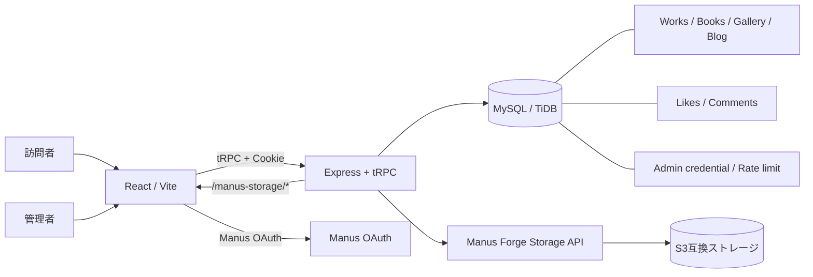

# 月春の資材置き場（tiny-room-portfolio）

写真、Web作品、読書記録、Blogを静かにまとめた、月春の個人ポートフォリオサイトです。
淡い水色を主役に、淡いピンクをアクセントとして使ったギャラリー風のデザインと、オーナー自身がGUIからコンテンツを更新できる管理機能を組み合わせています。

- **公開サイト:** [tukiharu-portfolio.manus.space](https://tukiharu-portfolio.manus.space)
- **別公開ドメイン:** [tinyroom-8bao7fvi.manus.space](https://tinyroom-8bao7fvi.manus.space)
- **リポジトリ:** [noppy3325-droid/tukiharu-portfolio](https://github.com/noppy3325-droid/tukiharu-portfolio)

> このREADMEは、現在の実装と運用方針を把握するための入口です。詳細なファイル構成や検証記録は、末尾のドキュメント一覧を参照してください。

## 目次

- [このサイトについて](#このサイトについて)
- [主な機能](#主な機能)
- [設計上の工夫とこだわり](#設計上の工夫とこだわり)
- [技術構成](#技術構成)
- [アーキテクチャ](#アーキテクチャ)
- [画像の保存と公開](#画像の保存と公開)
- [認証・認可とセキュリティ](#認証認可とセキュリティ)
- [ディレクトリ構成](#ディレクトリ構成)
- [開発・検証](#開発検証)
- [運用メモ](#運用メモ)
- [関連ドキュメント](#関連ドキュメント)

## このサイトについて

「月春の資材置き場」は、作品を一方的に並べるだけではなく、写真や文章などを少しずつ追加していける個人サイトとして設計しています。

サイト名の「資材置き場」には、完成した作品だけでなく、制作物、撮影した写真、読んだ本、考えたことを気軽に置いておく場所にしたいという意味を込めています。

デザインは、テンプレートらしい派手なランディングページではなく、個人のギャラリーとして長く使えることを重視しています。十分な余白、細身の文字、控えめな動き、淡い水色とピンクの斜め切りセクションによって、コンテンツが主役になる見た目を目指しました。

## 主な機能

### 公開ページ

- **Home**
  - サイトの入口となるデスクトップ風のホーム画面
  - 自己紹介
  - 最近の更新を新しい順に表示
  - Works、Library、Gallery、Blog、Aboutへのナビゲーション
  - 連絡先リンク
- **Works**
  - Web作品や制作物の一覧
  - カテゴリ、概要、サムネイル画像
  - HTTPS外部リンクの表示と新しいタブでの遷移
- **Gallery**
  - 写真を元画像の縦横比のまま表示
  - 画像クリックによる拡大表示
  - カメラ、レンズ、撮影場所、撮影日時などの撮影情報
  - 写真の右クリック、ドラッグ、モバイル長押しなどを可能な範囲で抑止
- **Library**
  - 本のタイトル、著者、メモ、表紙画像
- **Blog**
  - 公開記事の一覧と記事詳細
  - 匿名いいね
  - Manus OAuthログインユーザーによるコメント
  - コメントの編集、削除、短時間の取り消し
  - 編集済みラベル
  - 記事詳細下部の前後記事ナビゲーション
- **About**
  - サイトと運営者についての説明
  - Homeと共有する自己紹介文

### 管理機能

管理画面は、一般公開ページとは分離されたオーナー向けCMSです。ブラウザのGUIから、次のコンテンツを登録・編集・削除できます。

- 自己紹介文
- Works
- Books / Library
- Gallery
- Blog記事
- 管理者パスワード

削除操作では確認ダイアログを表示し、誤操作を減らします。モバイルでは管理項目をハンバーガーメニュー型のSheetにまとめ、狭い画面でも操作しやすいようにしています。

### 画像アップロード

- Gallery、Works、Books、Blog本文画像に対応
- 管理画面からファイルを直接選択
- アップロード前のプレビュー
- JPEG、PNG、WebPを検証
- Canvasによるクライアント側の自動圧縮
- 「画質優先」「バランス」「容量優先」の最適化モード
- SafariでJPEGやWebPの変換結果が異なる場合のフォールバック
- 元画像より大きくなる圧縮結果を採用しない安全策
- Galleryの複数画像一括登録
- Gallery一括登録時の共通タイトル、キャプション、撮影詳細の入力
- ファイル名からタイトルなどを補完し、画像アップロード後の保存忘れを減らす仕組み

画像本体はデータベースに保存せず、S3互換ストレージに保存します。データベースやBlog本文には、保存先を参照するURLだけを記録します。

## 設計上の工夫とこだわり

### 1. コンテンツを主役にするギャラリーデザイン

背景や装飾を強くしすぎず、写真、作品、文章が読みやすいことを優先しています。

- ベースカラーは淡い水色
- セクションごとに淡いピンクと水色を交互に使用
- 余白を広く取り、カードを詰め込みすぎない
- 明朝・細身のゴシックを意識した繊細なタイポグラフィ
- ホバーやページ遷移は短く控えめにし、閲覧を邪魔しない
- `prefers-reduced-motion` を尊重

### 2. デスクトップ風ホームと、ページ分割された情報設計

ホーム画面には、サイト全体の入口としてデスクトップ風のステージとDock風ナビゲーションを配置しています。一方、Works、Gallery、Library、Blog、Aboutは独立ページに分け、目的のコンテンツへ直接移動できる構成にしています。

これにより、ホームの世界観を楽しみながら、閲覧者が迷わず目的のページへ移動できます。

### 3. Safariとモバイルを前提にしたナビゲーション

過去にBlogページから抜けにくくなる問題があったため、ページ間の主要リンクにはブラウザ標準のアンカー遷移を使用しています。クライアントルーターだけに依存せず、Safariでも戻り先を確保する方針です。

また、モバイル幅では横並びのナビゲーションを隠し、常に操作できるMENUボタンへ切り替えます。メニューのz-index、タッチ領域、オーバーレイのpointer-eventsを調整し、BlogやGallery上でタップ操作が阻害されないようにしています。

### 4. 使いやすさと安全性を両立した画像管理

「S3へはアップロードできたが、サイトへの保存に失敗する」という状態を避けるため、アップロード成功時に画像URLをフォームへ自動反映します。タイトルやキャプションが空の場合は、ファイル名などから初期値を補完します。

ただし、画像保護については技術的な限界があります。ブラウザで表示する以上、開発者ツール、画面撮影、URL取得などを完全に防止することはできません。そのため本サイトでは、一般的な右クリック、ドラッグ、長押し、保存ショートカットを可能な範囲で抑止する、現実的なUI上の保護を採用しています。

### 5. 画面の非表示だけに頼らない管理者保護

管理画面へのリンクや編集ボタンを一般ユーザーに見せないだけではなく、サーバー側の管理用tRPC手続きでも管理者セッションを検証します。

- 管理者パスワードはscryptでハッシュ化
- 署名付きHTTP専用Cookieで管理者セッションを管理
- セッションの有効期限を設定
- ログイン失敗回数をDBで共有し、一定回数を超えた試行を制限
- 管理者以外のコンテンツ作成・更新・削除・画像アップロードを拒否
- Blog本文HTMLをサーバー側でサニタイズ
- 外部リンクはHTTPSに限定
- 画像URLはHTTPSまたは`/manus-storage/`に限定

### 6. Blogコメントはログイン、いいねは匿名

閲覧といいねはログイン不要にして閲覧のハードルを下げつつ、コメントはManus OAuthログインを必須にしています。コメントの作成者を識別できるため、本人による短時間の編集・削除・取り消しを安全に扱えます。

管理者へのコメント通知も実装しており、サイトを公開した後の運用を意識しています。

## 技術構成

| 分類 | 採用技術 | 用途 |
|---|---|---|
| フロントエンド | React 19、TypeScript、Vite 7 | UI描画、型安全な開発、ビルド |
| スタイリング | Tailwind CSS 4、機能別CSS | レイアウト、レスポンシブ対応、テーマ |
| UI部品 | Radix UI、Lucide React、Sonner、Vaul | Dialog、Sheet、Tabs、通知、アイコン |
| ルーティング | Wouter | 公開ページと管理画面のルーティング |
| API | tRPC 11、TanStack React Query、SuperJSON | 型付き通信、キャッシュ、Dateの受け渡し |
| サーバー | Express 4、tsx、esbuild | API、開発サーバー、本番バンドル |
| データベース | MySQL / TiDB、Drizzle ORM、Drizzle Kit | コンテンツ、認証情報、コメント、いいね |
| 認証 | Manus OAuth、scrypt、HMAC署名Cookie | コメント用ログイン、管理者認証 |
| ファイル保存 | Manus Forge Storage API、S3互換ストレージ | 画像のアップロードと配信 |
| 入力検証 | Zod、sanitize-html | API入力、Blog本文HTML、URLの検証 |
| テスト | Vitest、TypeScript、Prettier | 回帰テスト、型検査、コード整形 |
| ホスティング | Manus WebDev Autoscale | 開発プレビュー、ビルド、公開 |

## アーキテクチャ



基本的な処理の流れは次のとおりです。

1. React画面がtRPCを通じて公開データを取得する
2. Express側のルーターが入力検証と認可を行う
3. `server/db.ts`に集約したDrizzleクエリでデータベースを操作する
4. 画像はS3互換ストレージに保存し、DBにはURLのみを記録する
5. Blog本文はサニタイズしてから保存・公開する

## 画像の保存と公開

### 推奨ワークフロー

1. `/admin`へ管理者パスワードでログインする
2. Gallery、Works、Books、Blog本文の対象フォームを開く
3. 画像ファイルを選択する
4. 最適化モードとプレビューを確認する
5. アップロードする
6. 自動入力されたタイトル・キャプションなどを確認する
7. 保存する

プロジェクト内の`client/public/`や`client/src/assets/`へ大きな画像を直接置く運用は推奨しません。ビルドサイズやデプロイ時間が増えるため、管理画面のアップロード機能とS3互換ストレージを使用します。

### 対応形式・容量

- 対応形式: JPEG、PNG、WebP
- サーバー側の受け入れ上限: 5MB
- クライアント側で用途別に長辺と容量目標を調整
- ファイルのMIMEタイプだけでなく、バイナリ署名も検証
- 保存キーは用途別に`gallery/`、`works/`、`books/`、`blog/`へ分離

S3上の未参照ファイルを自動削除する機能はなく、アップロード後にDB保存が失敗した場合などは未参照オブジェクトが残る可能性があります。現状はDBから参照を外す運用を基本とし、将来的には未参照ファイルの整理機能を追加する余地があります。

## 認証・認可とセキュリティ

### 一般ユーザー

- 公開ページの閲覧: ログイン不要
- Blogのいいね: ログイン不要
- Blogコメント: Manus OAuthログイン必須
- 自分のコメントの編集・削除: 投稿後の時間制限付き

### 管理者

管理者認証は公開サイトのOAuthロールとは別の、専用パスワードセッション方式です。

- パスワードは平文保存しない
- scryptでハッシュ化し、saltとともに保存
- HMAC署名付きCookieを発行
- CookieはHTTP専用・有効期限付き
- 失敗回数を送信元識別子のハッシュで記録
- 15分間に5回失敗するとログインを制限
- 管理APIは`ctx.isAdmin`を検証

秘密情報はリポジトリへコミットせず、Webアプリの環境変数で管理します。代表的な設定は次のとおりです。

- `DATABASE_URL`
- `JWT_SECRET`
- `VITE_APP_ID`
- `OAUTH_SERVER_URL`
- `VITE_OAUTH_PORTAL_URL`
- `BUILT_IN_FORGE_API_URL`
- `BUILT_IN_FORGE_API_KEY`

## ディレクトリ構成

```text
.
├── client/
│   ├── index.html             # 静的head、SEOメタ情報
│   └── src/
│       ├── components/        # 共通レイアウト、管理UI、汎用UI
│       ├── contexts/          # テーマなどの状態
│       ├── hooks/             # 共通Hooks
│       ├── lib/               # tRPC、画像圧縮などのクライアント処理
│       ├── pages/             # Home、Works、Gallery、Blog、Adminなど
│       ├── App.tsx            # ルートと共通Provider
│       ├── main.tsx           # Reactの起点
│       └── *.css              # ギャラリー、モバイル、アップロード等のスタイル
├── server/
│   ├── _core/                 # Express、OAuth、tRPC、ストレージ基盤
│   ├── routers/               # content、blogなどのtRPCルーター
│   ├── db.ts                  # Drizzleクエリ
│   ├── adminSession.ts        # 管理者パスワードとセッション
│   ├── adminLoginRateLimit.ts # 管理者ログイン制限
│   ├── imageUpload.ts         # MIME、署名、容量検証
│   ├── sanitizeBlogHtml.ts    # Blog本文のサニタイズ
│   └── storage.ts              # S3互換ストレージ連携
├── drizzle/
│   ├── schema.ts               # DBスキーマの正本
│   └── *.sql                   # マイグレーション履歴
├── shared/                    # 共通型・定数
├── scripts/                   # ブラウザ検証用スクリプト
├── package.json               # コマンドと依存関係
├── vite.config.ts             # Vite設定
├── vitest.config.ts           # Vitest設定
└── tsconfig.json              # TypeScript設定
```

### 主なデータテーブル

| テーブル | 内容 |
|---|---|
| `users` | Manus OAuthユーザー |
| `adminCredentials` | 管理者パスワードのハッシュとsalt |
| `adminLoginAttempts` | 管理者ログイン失敗回数の共有記録 |
| `siteSettings` | HomeとAboutで共有する自己紹介文 |
| `works` | 作品情報、URL、サムネイル |
| `books` | 本の情報、表紙画像 |
| `galleryItems` | 写真、撮影機材、場所、撮影日時 |
| `blogPosts` | Blog記事、本文、公開状態 |
| `blogLikes` | 匿名いいねの重複防止情報 |
| `blogComments` | OAuthユーザーのコメント |

## 開発・検証

### セットアップ

```bash
pnpm install
```

環境変数をWebDevのプロジェクト設定などで用意したうえで、次のコマンドを使用します。

### よく使うコマンド

| コマンド | 用途 |
|---|---|
| `pnpm dev` | 開発サーバーを起動 |
| `pnpm check` | TypeScript型検査 |
| `pnpm test` | Vitestを実行 |
| `pnpm build` | ViteとExpressの本番ビルド |
| `pnpm format` | Prettierで整形 |
| `pnpm drizzle-kit generate` | スキーマからマイグレーションSQLを生成 |
| `pnpm db:push` | Drizzleのマイグレーションを実行 |
| `pnpm audit --prod` | 本番依存関係を監査 |

### 変更時の基本手順

1. 画面だけでなく、データモデルとAPIの責務を確認する
2. DB変更がある場合は`drizzle/schema.ts`を更新する
3. マイグレーションSQLを生成し、内容を確認する
4. `server/db.ts`にクエリを追加する
5. `server/routers/`に入力検証と認可を実装する
6. UIからtRPCを呼び出す
7. 成功、失敗、未ログイン、非管理者のテストを追加する
8. `pnpm check`、`pnpm test`、`pnpm build`を実行する
9. デスクトップ幅とモバイル幅で主要導線を確認する

### 現在の公開状態

- Home、Works、Gallery、Library、Blog、About、Adminを実装
- Gameタブと飛行機ミニゲームは削除済み
- 最新の公開版では、Game専用依存パッケージと専用チャンクも整理済み
- Google Search Console向けのHome SEOメタ情報を設定済み

## 運用メモ

- コンテンツの追加・編集は管理画面から行う
- 画像本体はDBではなくストレージへ保存する
- 公開画像の完全なダウンロード防止はできないため、UI上の抑止として扱う
- 管理者パスワードは長く推測しにくいものを設定する
- `JWT_SECRET`やForgeのAPIキーをGitへコミットしない
- DBスキーマ変更後は、型・API・UI・テストの整合性を確認する
- 外部URLはHTTPSで登録する
- Blog本文へ画像を挿入する場合は、画像の説明（alt）を入力する
- 公開後にキャッシュが残っている場合は、通常の再読み込みで最新版を確認する

## 関連ドキュメント

- [`project-architecture-map-2026-08-19.md`](./project-architecture-map-2026-08-19.md) — ファイル構造、サービス、DB、認証の詳細マップ
- [`qa-notes.md`](./qa-notes.md) — 機能追加・不具合修正・ブラウザ確認の記録
- [`final-audit-2026-08-19.md`](./final-audit-2026-08-19.md) — 最終品質・安全性監査
- [`final-audit-report-2026-08-19.md`](./final-audit-report-2026-08-19.md) — 監査内容の詳細版
- [`todo.md`](./todo.md) — 実装・検証タスクの履歴
- [`design-reference-notes.md`](./design-reference-notes.md) — デザイン検討メモ

## ライセンス

このプロジェクトのライセンスは、`package.json`に記載されたMIT Licenseに準拠します。サイト内の写真、文章、作品などのコンテンツの利用条件は、ライセンス表記とは別に、各コンテンツの権利者・作者の意向に従ってください。
