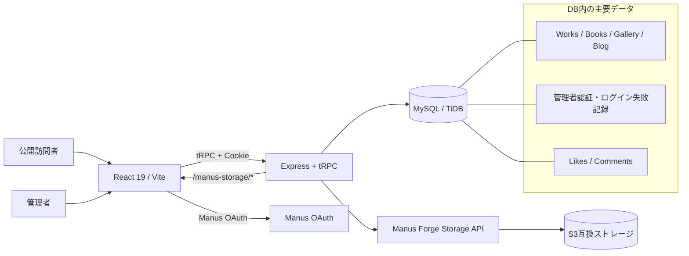
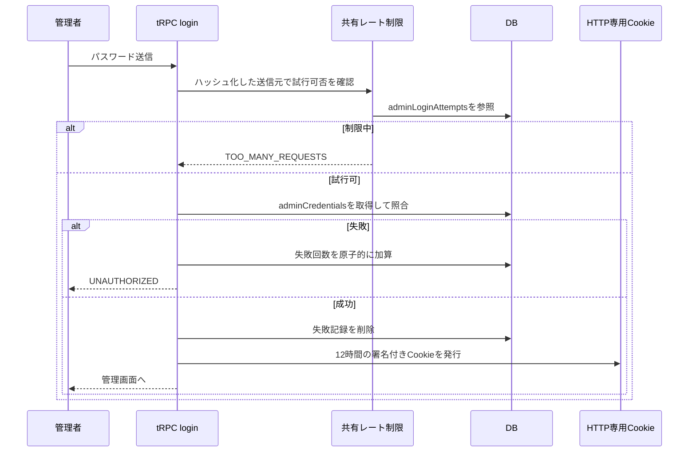

# 月春の資材置き場 — プロジェクト構成・技術マップ

| 項目 | 内容 |
|---|---|
| プロジェクト | 月春の資材置き場（`tiny-room-portfolio`） |
| 文書目的 | 新規機能の実装、保守、引き継ぎ時に「どこに何があるか」を短時間で把握できるようにする。 |
| アプリケーション種別 | 個人ポートフォリオ＋Blog＋オーナー向けコンテンツ管理画面 |
| 公開URL | <https://tinyroom-8bao7fvi.manus.space> |
| 主な構成 | React 19、Vite、TypeScript、tRPC 11、Express 4、MySQL／TiDB、Drizzle ORM、S3互換ストレージ |
| 対象版 | `40aaf6bc` |

> **文書ステータス:** 最終版。今回追加したBlog本文画像の代替テキスト入力と、DB共有型の管理者ログイン試行制限を反映しています。

## 1. 全体像

公開サイトはReactで描画され、画面からのデータ取得・更新はすべてtRPC APIを通ります。ExpressサーバーはtRPC、Manus OAuth、ストレージプロキシ、開発／本番の静的配信を統合します。コンテンツ、管理者認証情報、ログイン試行制限はMySQL／TiDBに保存し、画像本体はS3互換ストレージに保存します。[1] [2] [3]

> **設計原則:** 公開閲覧・いいね・コメントと、オーナーによるコンテンツ操作は分離されています。画面上で管理ボタンを隠すだけでなく、管理用tRPC手続きと画像アップロードもサーバー側の管理者セッションで保護します。[4] [5]

## 2. ルートディレクトリの地図

| パス | 役割 | 編集する場面 |
|---|---|---|
| `client/` | Reactフロントエンド、公開ページ、管理画面、CSS、UI部品。 | 表示、操作、モバイルUI、管理画面を変えるとき。 |
| `server/` | tRPC API、DBアクセス、管理者認証、入力検証、画像保存。 | データ操作、認可、セキュリティ、サーバー処理を変えるとき。 |
| `drizzle/` | DBスキーマ、履歴SQL、Drizzleのメタデータ。 | テーブルやカラムを追加・変更するとき。 |
| `shared/` | クライアント・サーバー間で共有する定数・型。 | Cookie名、共通型、共通エラーを変えるとき。 |
| `package.json` | 実行コマンドと依存パッケージ。 | ライブラリ追加・更新、ビルド／テストの確認時。 |
| `drizzle.config.ts` | Drizzleのスキーマ参照先、DB接続設定。 | マイグレーションの生成時。 |
| `vite.config.ts` / `vitest.config.ts` | Viteのビルド／開発設定、Vitest設定。 | ビルドやテスト基盤を変えるとき。 |
| `todo.md` | 実装・検証タスクの履歴。 | 機能追加や不具合報告の直後。 |
| `qa-notes.md` / `final-audit*.md` | 手動確認と最終品質監査の記録。 | リリース前確認、保守時の判断材料。 |

## 3. フロントエンド（`client/src/`）

### 3.1 起動・データ通信・ルーティング

| ファイル | 責務 | 主な内容 |
|---|---|---|
| `main.tsx` | フロントエンドの起点。 | React root、React Query、tRPCクライアント、SuperJSON、Cookie付き通信、OAuthエラー時のログイン導線を設定する。[1] |
| `App.tsx` | 画面ルートとアプリ共通Provider。 | `wouter`で公開ページ・管理画面を切り替える。全ページを遅延読み込みし、`ErrorBoundary`、テーマ、トースト、ページ遷移を共通化する。[2] |
| `lib/trpc.ts` | 型付きtRPCフックの入口。 | `trpc.*.useQuery()`／`useMutation()`を各コンポーネントで使うための定義。 |
| `contexts/ThemeContext.tsx` | テーマの状態管理。 | 共通のライトテーマ設定を提供する。 |
| `components/ErrorBoundary.tsx` | 予期しない描画エラーの境界。 | 画面全体が白くなることを避け、復帰可能な表示を担当する。 |
| `components/PageTransition.tsx` | ページ遷移の控えめなフェード。 | 同一オリジンの通常リンクだけに適用し、Safari互換のアンカー遷移を維持する。 |

### 3.2 ページ（`pages/`）

| ファイル | URL | 役割 |
|---|---|---|
| `Home.tsx` | `/` | Galleryカード、自己紹介、更新情報、連絡先を表示するトップページ。 |
| `Works.tsx` | `/works` | 作品一覧を表示する。 |
| `Library.tsx` | `/library` | 読んだ本・おすすめ本の一覧を表示する。 |
| `Photos.tsx` | `/photos` | Gallery一覧と写真の撮影情報を表示する。 |
| `Blog.tsx` | `/blog` | 公開済みBlog一覧、空・取得失敗などの状態を表示する。 |
| `BlogPost.tsx` | `/blog/:slug` | 記事本文、匿名いいね、OAuth必須コメント、前後記事リンクを表示する。 |
| `About.tsx` | `/about` | サイト説明、自己紹介、連絡先を表示する。 |
| `Admin.tsx` | `/admin` | パスワード認証後のオーナー用CMS。自己紹介、Blog、Works、Books、Gallery、パスワード変更を扱う。 |
| `NotFound.tsx` | 未定義URL | 404画面と復帰導線。 |
| `ComponentShowcase.tsx` | 開発補助 | UI部品の確認用。通常の公開導線には含めない。 |

### 3.3 重要コンポーネント（`components/`）

| ファイル | 責務 | 変更時の注意 |
|---|---|---|
| `TsukiLayout.tsx` | 公開サイト共通のヘッダー、デスクトップNav、モバイルMENU、フッター、控えめな管理者リンク。 | グローバル導線を変える中心ファイル。リンクはSafari互換の通常アンカーを維持する。 |
| `RichTextEditor.tsx` | Blog本文の簡易リッチテキスト編集、本文画像の圧縮・アップロード・挿入。 | 本文画像の「画像の説明」を入力すると`img`の`alt`属性へ保存する。空欄は装飾画像として明示的に扱う。[6] |
| `AdminImageUpload.tsx` | Works、Books、Gallery等の単体画像を選択・圧縮・プレビュー・アップロード。 | ファイル本体をDBに保存せず、S3 URLだけをフォームへ渡す。 |
| `AdminBatchImageUpload.tsx` | Galleryの最大12枚一括選択・圧縮・プレビュー・アップロード。 | 部分失敗を成功として扱わず、登録結果を正確に表示する。 |
| `BlogPostNavigation.tsx` | 記事の前後移動リンク。 | 記事が端点の場合の案内も含む。 |
| `ui/` | Radix UIベースの汎用UI部品。 | ボタン、Sheet、Tabs、Dialog等の土台。原則として画面固有のロジックは置かない。 |

### 3.4 クライアント側ライブラリ・スタイル・テスト

| パス | 責務 |
|---|---|
| `lib/imageUpload.ts` | JPEG／PNG／WebPの選択検証、長辺1920pxへの縮小、WebP圧縮、Base64化、容量表示。 |
| `lib/richTextImage.ts` | Blog本文に挿入する`img` HTMLを生成する。`src`と`alt`の属性値をエスケープする。 |
| `lib/notes.ts` / `lib/homeUpdates.ts` | Blogの読込・空・エラー状態、Home更新情報の整列ロジック。 |
| `gallery-portfolio.css` | 公開サイトのギャラリー・ポートフォリオ用メインスタイル。 |
| `mobile-navigation-fix.css` | モバイルBlogのタップ阻害を避けるz-index、pointer-events、touch-action対策。 |
| `content-image-uploads.css` | 画像アップロード、本文画像の代替テキスト入力、記事本文内画像のスタイル。 |
| `*.test.ts` / `*.test.tsx` | クライアント側の状態判定、ナビゲーション、画像圧縮、代替テキストHTML、モバイル操作の回帰テスト。 |

## 4. サーバー（`server/`）

### 4.1 実行基盤（`server/_core/`）

`server/_core/`はテンプレートの実行基盤です。通常のコンテンツ機能は`server/routers/`、`server/db.ts`、専用ユーティリティへ追加します。基盤を編集する場合は、認証・配信・エラー処理への影響を確認します。

| ファイル | 責務 |
|---|---|
| `_core/index.ts` | Express・HTTPサーバーを起動し、JSON／本文サイズ、OAuth、ストレージプロキシ、tRPC、Vite開発配信／本番静的配信を接続する。[3] |
| `_core/context.ts` | 各tRPCリクエストにOAuthユーザーと管理者セッションの情報を積み、`ctx.user`と`ctx.isAdmin`を作る。 |
| `_core/trpc.ts` | tRPCルーター、public／protected procedure、production時のエラー情報の扱いを定義する。 |
| `_core/oauth.ts` / `_core/sdk.ts` | Manus OAuthとSDKの接続。 |
| `_core/storageProxy.ts` | `/manus-storage/*`への画像配信を仲介する。 |
| `_core/env.ts` | `DATABASE_URL`、`JWT_SECRET`、OAuth、Forge Storageの設定値をまとめる。 |
| `_core/cookies.ts` | セッションCookieの安全な属性設定。 |
| `_core/vite.ts` | 開発時のVite連携と本番の静的配信設定。 |

### 4.2 アプリケーションロジック

| ファイル | 責務 | 変更時の入口 |
|---|---|---|
| `routers.ts` | ルートtRPC API。公開認証、管理者ログイン／ログアウト／パスワード変更、Content・Blogルーターを合成する。 | 新しいトップレベルAPIを追加するとき。 |
| `routers/content.ts` | 自己紹介、Works、Books、Galleryの公開取得と管理者CRUD、画像アップロード。 | コンテンツ項目や画像保存の仕様を変えるとき。 |
| `routers/blog.ts` | Blog公開取得、いいね、コメント、前後記事、管理者用記事CRUD・コメント削除。 | Blog機能を変えるとき。 |
| `routers/guards.ts` | 管理者セッション必須のガード。 | 認可ルールを増やすとき。 |
| `db.ts` | Drizzleを使うDBクエリの集約。 | 画面やルーターから直接SQLを書かず、原則ここへ追加する。 |
| `adminSession.ts` | 管理者パスワードのハッシュ化・照合・署名付き管理者セッションの発行／検証。 | パスワード／Cookie／鍵の仕様を変えるとき。 |
| `adminLoginRateLimit.ts` | 管理者ログインの15分・5回制限。送信元をSHA-256でハッシュ化し、DB共有ストアで判定する。 | レート制限の閾値、IPキー、保存期間を変えるとき。[7] |
| `sanitizeBlogHtml.ts` | 保存・公開前のBlog HTMLサニタイズ。`img`の`src`、`alt`などを許可し、危険なタグ・属性・スキームを除去する。 | リッチテキストの許可要素を変えるとき。 |
| `imageUpload.ts` | サーバー側のMIME・署名・容量・安全な保存キーの検証。 | アップロード可能な形式や容量を変えるとき。 |
| `contentUrl.ts` | 外部コンテンツURLの許可判定。HTTPSまたは`/manus-storage/`だけを許可する。 | URL入力仕様を変えるとき。 |
| `storage.ts` | Forge APIでS3の署名付きPUT URLを取得し、ファイルを保存する。返却値は`/manus-storage/...`。 | 保存先やストレージ連携を変えるとき。[8] |

## 5. データベース（`drizzle/`）

スキーマの正本は`drizzle/schema.ts`です。構造を変更する場合は、**スキーマ更新 → `pnpm drizzle-kit generate` → 生成SQL確認 → SQL適用 → DBヘルパー・ルーター・UI・テスト更新**の順で進めます。[9]

| テーブル | 主なデータ | 使う箇所 |
|---|---|---|
| `users` | Manus OAuthユーザー、プロフィール、一般ユーザーロール。 | OAuthコンテキスト、コメント投稿者。 |
| `adminCredentials` | 管理者パスワードのscryptハッシュとsalt。 | `adminSession.ts`、`routers.ts`。 |
| `adminLoginAttempts` | ハッシュ化した送信元キー、失敗回数、時間窓開始時刻。 | DB共有型ログイン試行制限。再起動や複数インスタンスでも共有される。[7] |
| `siteSettings` | 公開自己紹介文。 | Home、About、Admin。 |
| `works` | 作品名、説明、カテゴリ、URL、サムネイルURL、並び順。 | Worksページ、Home、Admin。 |
| `books` | 本の題名、著者、メモ、表紙URL、色、並び順。 | Libraryページ、Home、Admin。 |
| `galleryItems` | 写真、キャプション、カメラ、レンズ、場所、撮影日時、回転、並び順。 | Galleryページ、Home、Admin。 |
| `blogPosts` | 記事タイトル、slug、抜粋、サニタイズ済みHTML、公開状態・日時。 | Blog一覧・詳細、Admin。 |
| `blogLikes` | 投稿IDと匿名訪問者キーの組。 | Blogいいねの重複防止と集計。 |
| `blogComments` | 投稿ID、OAuthユーザーID、コメント本文、日時。 | Blogコメントの表示・削除。 |

### 5.1 マイグレーション

`drizzle/0000_*.sql`から`0006_melted_albert_cleary.sql`までがスキーマ変更履歴です。最新の`0006`では、DB共有型のログイン試行制限用に`adminLoginAttempts`テーブルを追加しています。既存テーブルを削除・置換する変更は含まれていません。[10]

## 6. 認証・認可の流れ

### 6.1 一般訪問者とOAuthユーザー

公開ページの閲覧といいねはログイン不要です。コメントだけはManus OAuthログインを必要とし、OAuth完了後のユーザーは`users`テーブルと`ctx.user`を通じて識別されます。公開コンテンツの取得はpublic procedure、コメント投稿はprotected procedureとして分離されています。[1] [4]

### 6.2 管理者

管理画面はOAuthのユーザーロールとは別の**管理者パスワードセッション**で保護されています。正しいパスワードが確認されると、HTTP専用かつ署名付きCookieを発行します。管理画面でボタンを隠しているだけでなく、記事・コンテンツ・画像のすべての更新APIは`ctx.isAdmin`を要求します。[4] [5]

## 7. 画像・Blog本文画像の流れ

画像本体はDBに保存しません。ブラウザがJPEG／PNG／WebPを検証・圧縮し、管理者専用のtRPCアップロードへ送信します。サーバーはMIME・バイナリ署名・容量・用途別キーを再検証してS3へ保存し、DBまたはBlog本文には`/manus-storage/...`の参照URLだけを保存します。[5] [8]

Blog本文画像では、管理画面の「画像の説明」に入力した文字列を``として本文HTMLへ挿入します。属性値はブラウザ側でエスケープされ、サーバー側のHTMLサニタイズも`alt`属性を保持します。説明が不要な装飾画像は空欄で挿入でき、その場合も`alt=""`が保存されます。[6] [11]

## 8. 利用しているサービス・主要ライブラリ

| 分類 | サービス／ライブラリ | 用途 |
|---|---|---|
| ホスティング | Manus WebDev Autoscale | Webアプリのビルド・公開・ドメイン・開発プレビュー。 |
| フロントエンド | React 19、Vite 7、TypeScript | SPA描画、開発サーバー、型安全性。 |
| UI | Tailwind CSS 4、Radix UI、Lucide、Sonner、Vaul | レイアウト、アクセシブルな基本UI、アイコン、通知、Sheet。 |
| ルーティング | Wouter | ページURLとコンポーネントの対応付け。 |
| 通信・キャッシュ | tRPC 11、TanStack React Query、SuperJSON | 型付きAPI、キャッシュ、データ同期、Dateのシリアライズ。 |
| サーバー | Express 4、esbuild、tsx | API実行、開発時の監視、本番サーバーバンドル。 |
| DB | MySQL／TiDB、Drizzle ORM、Drizzle Kit、mysql2 | コンテンツ、認証、リアクション、共有レート制限の永続化。 |
| 認証 | Manus OAuth、`jose`、scrypt | コメント用OAuth、管理者Cookieの署名、管理パスワードのハッシュ化。 |
| ストレージ | Manus Forge Storage API、S3互換ストレージ、AWS SDK | 署名付きURLによる画像保存と`/manus-storage/`配信。 |
| セキュリティ | Zod、sanitize-html、cookie | 入力検証、Blog HTMLサニタイズ、Cookie属性の安全な管理。 |
| テスト・品質 | Vitest、TypeScript、Prettier、pnpm audit | ユニットテスト、型検査、整形、依存関係監査。 |

## 9. 環境変数と秘密情報

値はソースコードやドキュメントへ書かず、Webアプリ設定から管理します。主な設定キーと用途は次のとおりです。[12]

| 環境変数 | 用途 | 公開可否 |
|---|---|---|
| `DATABASE_URL` | MySQL／TiDBへの接続。 | 秘密 |
| `JWT_SECRET` | 管理者セッション署名に使う秘密鍵。未設定ならセッションを発行しない。 | 秘密 |
| `VITE_APP_ID` / `OAUTH_SERVER_URL` / `VITE_OAUTH_PORTAL_URL` | Manus OAuthのアプリ識別とログイン先。 | 設定値として管理 |
| `OWNER_OPEN_ID` / `OWNER_NAME` | プロジェクト所有者に関するシステム設定。 | 非公開推奨 |
| `BUILT_IN_FORGE_API_URL` / `BUILT_IN_FORGE_API_KEY` | Forge経由のS3ストレージ操作。 | 秘密 |
| `VITE_ANALYTICS_ENDPOINT` / `VITE_ANALYTICS_WEBSITE_ID` | ページ分析スクリプト設定。 | サイト設定に準じる |

## 10. 日常作業の入口早見表

| やりたいこと | 最初に見るファイル | 次に触る場所 |
|---|---|---|
| 新しい公開ページを追加したい | `client/src/App.tsx` | `pages/`、`TsukiLayout.tsx`、必要なら`routers/`。 |
| Blogの本文編集を改善したい | `components/RichTextEditor.tsx` | `sanitizeBlogHtml.ts`、`routers/blog.ts`、対応テスト。 |
| Galleryの撮影情報を増やしたい | `drizzle/schema.ts` | migration、`db.ts`、`routers/content.ts`、`Admin.tsx`、`Photos.tsx`。 |
| 管理者認証を変えたい | `adminSession.ts`、`adminLoginRateLimit.ts` | `routers.ts`、`_core/context.ts`、認証テスト。 |
| 画像の形式・圧縮・上限を変えたい | `lib/imageUpload.ts` | `server/imageUpload.ts`、`routers/content.ts`、画像テスト。 |
| 公開ナビゲーションを変えたい | `components/TsukiLayout.tsx` | `App.tsx`、`gallery-portfolio.css`、モバイル確認。 |
| DBカラムやテーブルを追加したい | `drizzle/schema.ts` | `pnpm drizzle-kit generate`、生成SQL確認、DB適用、`db.ts`、UI、テスト。 |
| APIエラーの見せ方を変えたい | `server/_core/trpc.ts` | 各ページのerror state、例外導線テスト。 |

## 11. 開発・検証コマンド

| コマンド | 用途 |
|---|---|
| `pnpm dev` | Express＋Viteの開発サーバーを起動する。 |
| `pnpm check` | TypeScript型検査。 |
| `pnpm test` | Vitestのユニットテスト。現在は**16ファイル・54件**。 |
| `pnpm build` | ViteクライアントとExpressサーバーの本番ビルド。 |
| `pnpm audit --prod` | 本番依存関係の既知脆弱性確認。 |
| `pnpm drizzle-kit generate` | `drizzle/schema.ts`の差分からSQLマイグレーションを生成。 |

## 12. 変更時の安全な手順

コンテンツ機能を追加する場合は、まずDBスキーマとデータモデルを決め、必要なマイグレーションを非破壊的に適用します。その後、`server/db.ts`にクエリ、`server/routers/`に入力検証と認可、`client/src/`にUIを追加します。最後に成功・失敗・非管理者拒否のテストを追加し、型検査、全テスト、本番ビルド、PC／モバイルの主要導線確認を行ってからチェックポイントを保存します。[4] [9]

セキュリティに関わる変更では、画面の非表示だけに依存せず、サーバーの手続きで必ず拒否します。画像や本文HTMLを扱う変更では、クライアント側の使いやすさと同時に、サーバー側のMIME・署名・URL・HTMLサニタイズを確認してください。[5] [11]

## 参照資料

[1]: ./client/src/main.tsx "フロントエンド起動・tRPC・React Query設定"
[2]: ./client/src/App.tsx "ルート定義・遅延読み込み・共通Provider"
[3]: ./server/_core/index.ts "Expressサーバー起動・OAuth・tRPC・静的配信"
[4]: ./server/_core/context.ts "tRPCコンテキスト・OAuth・管理者セッション"
[5]: ./server/routers/content.ts "管理者限定コンテンツCRUD・画像アップロード"
[6]: ./client/src/components/RichTextEditor.tsx "Blog本文画像と代替テキスト入力"
[7]: ./server/adminLoginRateLimit.ts "DB共有型の管理者ログイン試行制限"
[8]: ./server/storage.ts "Forge経由のS3互換ストレージ連携"
[9]: ./drizzle/schema.ts "データベーススキーマ"
[10]: ./drizzle/0006_melted_albert_cleary.sql "共有ログイン試行制限テーブルのマイグレーション"
[11]: ./server/sanitizeBlogHtml.ts "Blog HTMLサニタイズ"
[12]: ./server/_core/env.ts "サーバー環境変数の境界"
